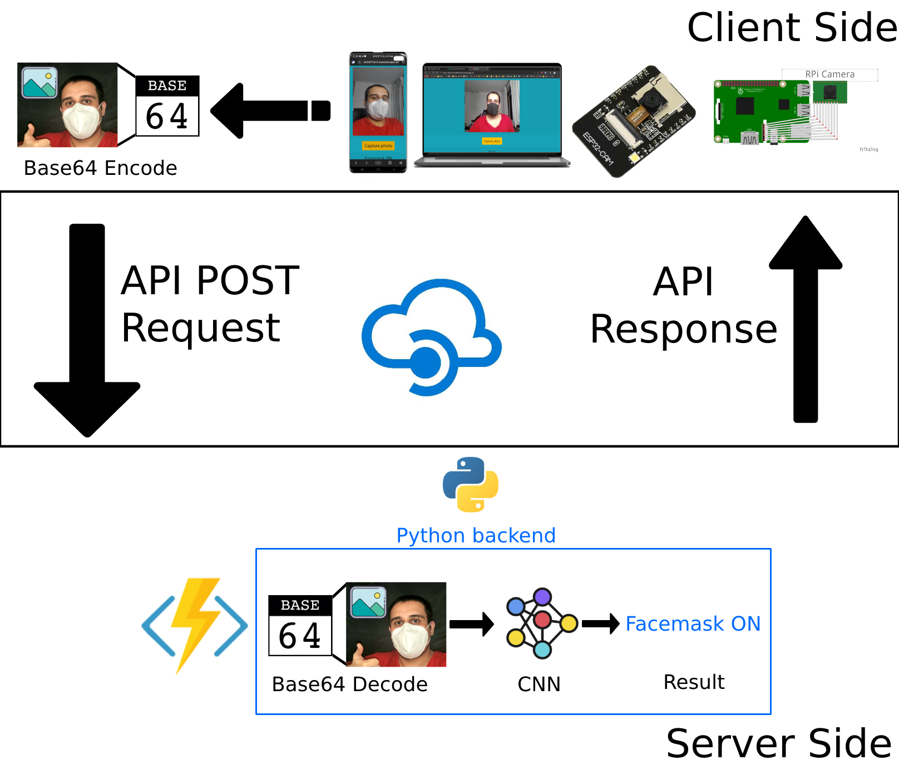
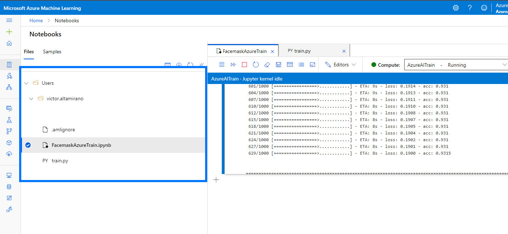
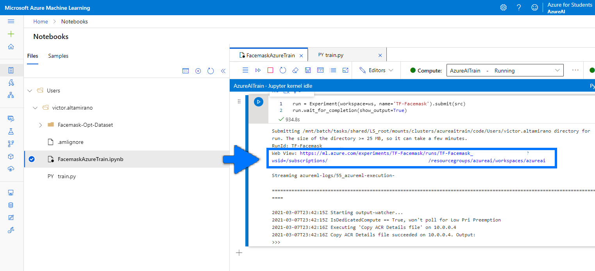
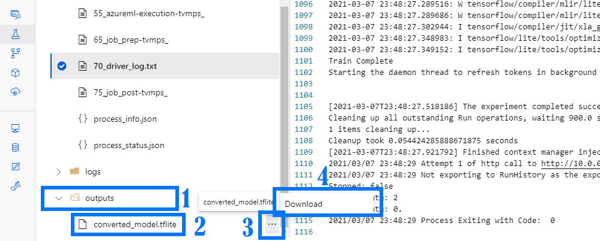
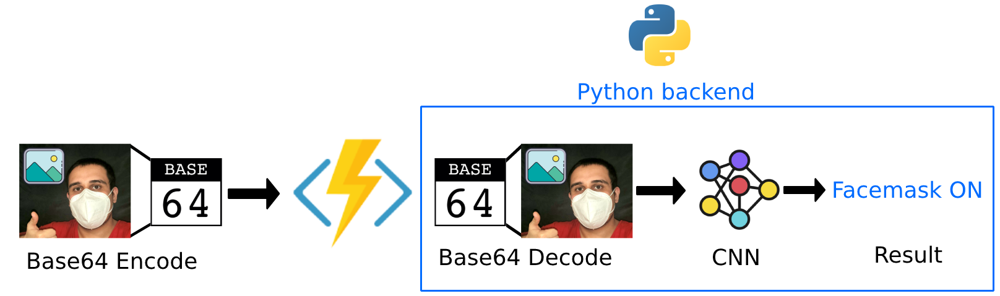
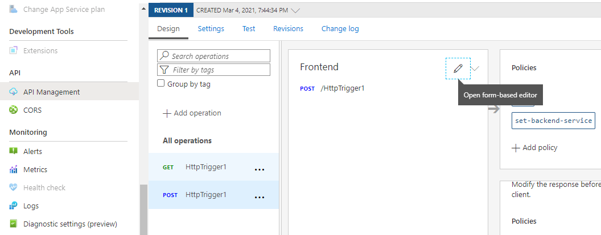
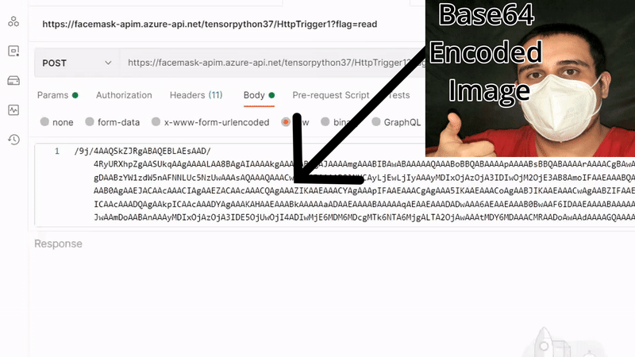

# Azure Facemask Detector

Implementación real de un servicio de detección de cubre bocas powereado por Azure ML, Function App y Azure API Management Service.

- [Azure Facemask Detector](#azure-facemask-detector)
- [Introduction](#introduction)
- [Solution](#solution)
  - [Current Solutions](#current-solutions)
- [Materials](#materials)
  - [Hardware](#hardware)
  - [Software](#software)
- [Connection Diagram](#connection-diagram)
- [AzureML Model Training](#azureml-model-training)
  - [Azure ML Settings](#azure-ml-settings)
- [Azure Model Deployment](#azure-model-deployment)
  - [Azure Function App](#azure-function-app)
- [Azure Function App Deployment as API](#azure-function-app-deployment-as-api)
- [Azure API implementation](#azure-api-implementation)
  - [Hardware Tested with the API](#hardware-tested-with-the-api)
  - [Devices Tested with the webapp](#devices-tested-with-the-webapp)
- [EPIC DEMO:](#epic-demo)

# Introduction

INVENTA ALGO

# Solution

INVENTA ALGO

## Current Solutions

lista de sluciones similares

# Materials

## Hardware

- ESP32 Cam.
  - https://www.amazon.com/Bluetooth-Low-Power-Dual-core-Monitoring-Identification/dp/B07Q4BY77Q/ref=sr_1_2?dchild=1&keywords=ai+thinker&qid=1615175201&sr=8-2
- RaspberryPi 4.
  - https://www.amazon.com/CanaKit-Raspberry-Basic-Kit-8GB/dp/B08DJ9MLHV/ref=sr_1_3?crid=1TQ9UPBSVAFMF&dchild=1&keywords=raspberry+pi+4&qid=1615175226&sprefix=raspberr%2Caps%2C243&sr=8-3
- RaspberryPi Camera.
  - https://www.amazon.com/Raspberry-Pi-Camera-Module-Megapixel/dp/B01ER2SKFS/ref=sr_1_3?dchild=1&keywords=raspberry+pi+camera&qid=1615175239&sr=8-3
- Smartphone.
- Desktop Computer.

## Software

- ArduinoIDE (ESP32)
  - https://www.arduino.cc/en/main/OldSoftwareReleases
- RaspberryPi OS (RaspberryPi)
  - https://www.raspberrypi.org/software/
- ReactJS (WebApp)
  - https://reactjs.org/
- Postman
  - https://www.postman.com/
- TensorFlow
  - https://www.tensorflow.org/
- Microsoft Azure Services:
  - Azure Machine Learning
    - https://azure.microsoft.com/en-us/free/machine-learning
  - Azure Function App
    - https://azure.microsoft.com/en-us/services/functions/
  - Azure API Management
    - https://azure.microsoft.com/en-us/services/api-management/

# Connection Diagram

# AzureML Model Training

El modelo de inteligencia artificial se entreno en la plataforma de Machine Learning de Azure, con el framework de TensorFlow, todas las características de el environment de entrenamiento fueron las siguientes:

## Azure ML Settings

- Compute Attributes:
  -  Region: centralus
  -  Virtual machine size:
     -  STANDARD_DS2_V2 (2 Cores, 7 GB RAM, 14 GB Disk)
  - Processing Unit:
     -  CPU - General purpose
  - Kernel:
    - Python 3.6.9

Todo el codigo estara en el siguiente enlace:

https://github.com/altaga/Azure-Facemask-Detector/tree/main/Azure%20ML%20Train

Una vez los descargues tendrás que ponerlo en la interfaz de Azure de la siguiente forma.

Una Vez hecho esto podremos correr el entrenamiento sin problema, el codigo ya esta diseñado para bajar la base de datos se nuestro repositorio.

https://github.com/altaga/Facemask-Opt-Dataset

Una vez inicie el entrenamiento hay que poner mucha atencion al Link que aparecera en la interfaz, ya que con este link podremos acceder al model cuando termine el programa de ejecutarse.

Una vez termine el entrenamiento podremos descargar nuestro modelo de la siguiente forma, el modelo que estamos descargando es un modelo optimizado para tensorflow lite.

Ahora pasaremos a mostrar como realizamos el despliegue de nuestro modelo en una Function App.

# Azure Model Deployment

Para el deployment en cloud de nuestro modelo realizamos una function app, la cual es la que se encargara de ejecutar la interpretacion del modelo y la evaluacion del mismo, cada vez que le pasemos una imagen.

 
## Azure Function App

Las especificaciones relevantes de esta función son las siguientes:

- App Service Plan: 
  - CentralUSLinuxDynamicPlan (Y1: 0)
- Location:
  - CentralUS
- Environment:
  - **Python 3.7**
  - Tflite Interpreter 1.0.1
  - OpenCV 4.5.1.48

Todos los archivos que hacen funcionar a esta función están en el URL.

https://github.com/altaga/Azure-Facemask-Detector/tree/main/Azure%20Function%20App

Específicamente para que funcione tenemos que tener en el archivo requirements.txt de la función los siguientes paquetes.

    azure-functions
    https://github.com/google-coral/pycoral/releases/download/v1.0.1/tflite_runtime-2.5.0-cp37-cp37m-linux_x86_64.whl
    opencv-python

Todas las imágenes que mandemos a evaluarse en la función deberán mantener un aspect ratio de 4:3 o 3:4, no importando el tamaño de la imagen.

# Azure Function App Deployment as API

Para realizar la API de esta funcion agregaremos del menu lateral una API Management, para usar esta función requerimos que este disponible la operación POST.

Una vez este todo esto seteado, podremos probar nuestra API con Postman.

    curl --location --request POST 'https://facemask-apim.azure-api.net/tensorpython37/HttpTrigger1?flag=read' \
    --header 'Ocp-Apim-Subscription-Key: YOURAPPKEY' \
    --header 'Content-Type: text/plain' \
    --data-raw 'Base64Image'

La imagen que se uso para este test esta en la carpeta.

https://github.com/altaga/Azure-Facemask-Detector/tree/main/PostmanDemoImage

# Azure API implementation

Gracias a que es un servicio que es posible ser consumido por API, podemos prácticamente utilizar cualquier dispositivo de HW o SW para realizar la implementación. En este caso nosotros mostramos como realizamos esta implementación en los siguientes devices y plataformas.

## Hardware Tested with the API

Codes: https://github.com/altaga/Azure-Facemask-Detector/tree/main/Devices%20Tested

  - ESP32 Cam

Video: Click on the image

  - RPI4 with Camera

Video: Click on the image

  
## Devices Tested with the webapp

WebpageCode: 

(la pagina web consume directamente de la misma API):

- Web App Tested: https://polite-bush-0d957ae10.azurestaticapps.net/
  - Samsung Galaxy S10+
  - iPhone
  - Desktop

Video: Click on the image

# EPIC DEMO:

Video: Click on the image
