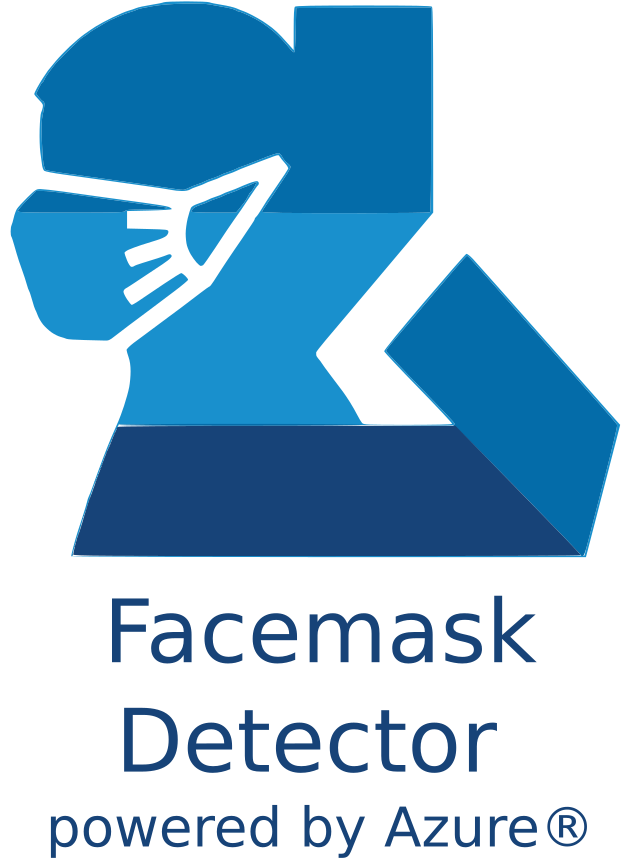

## Try it out!

Please allow access to your camera!

### https://polite-bush-0d957ae10.azurestaticapps.net/

# Azure Facemask Detector

Real implementation of a facemask detection service powered by Azure ML, Function App and Azure API Management Service.

- [Azure Facemask Detector](#azure-facemask-detector)
- [**Introduction**](#introduction)
- [**Problem**](#problem)
- [Solution](#solution)
- [Materials](#materials)
  - [Hardware](#hardware)
  - [Software](#software)
- [Connection Diagram](#connection-diagram)
- [AzureML Model Training](#azureml-model-training)
  - [Azure ML Settings](#azure-ml-settings)
- [Azure Model Deployment](#azure-model-deployment)
  - [Azure Function App](#azure-function-app)
- [Azure Function App Deployment as API](#azure-function-app-deployment-as-api)
- [Azure API implementation](#azure-api-implementation)
  - [Hardware Tested with the API](#hardware-tested-with-the-api)
  - [Devices Tested with the webapp](#devices-tested-with-the-webapp)
- [Device Images on businesses](#device-images-on-businesses)
- [EPIC DEMO](#epic-demo)

# **Introduction**

COVID-19 has changed our daily lives and continues to do so. Many retail stores and companies have gone out of business, unable to offer their services to their clients. However some others which have opted for the reopening of their businesses in turn have had to adapt to the times.This includes public institutions such as museums, libraries, etc. All these establishments have taken their precautionary measures, generating new regulations, such as forcing customers and / or visitors to wear face masks at all times. [1](#1).

Given this new environment, businesses have had to create neew kinds of jobs or jobs to be done. One of these is to check the use of the mask and check the temperature of the customers before entering the establishment, risking not only the worker who is checking the temperature of the customers, but to the customers who enter the place.

1. https://www.who.int/emergencies/diseases/novel-coronavirus-2019/advice-for-public/when-and-how-to-use-masks?gclid=Cj0KCQjwlvT8BRDeARIsAACRFiX_NyUiqU0d44aUqMNK7LVrXMOQWMfqr0MUUo8TKrJLpObf91qRUcUaAjKbEALw_wcB

# **Problem**

This job generates an annual cost per worker of at least $30,000 [1] and if that employee were to become ill with covid-19, by law (in the United States) they would have to pay him at least $511 a day [2].

These costs (both moneetary and health wise) for an employee who performs a repetitive task is excessive but necessary, because the solutions currently created are not yet sufficient to replace this position.

- The Xovis all-in-one solution - https://www.xovis.com/en/products/detail/face-mask-detection/
    - Only detection of the use of face masks, without temperature measurement, or access control.
- SecurOS™ Face Mask Detection - https://issivs.com/facemask/
    - Only detection of the use of face masks, without temperature measurement, or access control.
- Leewayhertz - https://www.leewayhertz.com/face-mask-detection-system/
    - Only detection of the use of face masks, without temperature measurement, or access control.

Most of the devices on the market only detect the use of the mask, however this project seeks to generate a complete solution for access control.

1. https://www.ziprecruiter.com/Salaries/Retail-Security-Officer-Salary
2. https://www.dol.gov/sites/dolgov/files/WHD/posters/FFCRA_Poster_WH1422_Non-Federal.pdf

# Solution

# Materials
 
**Optional** *  

## Hardware

- RaspberryPi 4
  - https://www.amazon.com/CanaKit-Raspberry-Basic-Kit-8GB/dp/B08DJ9MLHV/ref=sr_1_3?crid=1TQ9UPBSVAFMF&dchild=1&keywords=raspberry+pi+4&qid=1615175226&sprefix=raspberr%2Caps%2C243&sr=8-3
- RaspberryPi Camera or USB Camera
  - https://www.amazon.com/Raspberry-Pi-Camera-Module-Megapixel/dp/B01ER2SKFS/ref=sr_1_3?dchild=1&keywords=raspberry+pi+camera&qid=1615175239&sr=8-3
- MLX90614
  - https://www.amazon.com/dp/B071VF2RWM/ref=cm_sw_em_r_mt_dp_8594C7K62CE9DK4E9YFZ
- RPI Display
  - https://www.amazon.com/dp/B01J51CXU4/ref=cm_sw_em_r_mt_dp_AZVG8G6P3XVZ37GF04S7
- ESP32 Cam *
  - https://www.amazon.com/Bluetooth-Low-Power-Dual-core-Monitoring-Identification/dp/B07Q4BY77Q/ref=sr_1_2?dchild=1&keywords=ai+thinker&qid=1615175201&sr=8-2
- Smartphone *
- Desktop Computer *

## Software

- RaspberryPi OS (RaspberryPi)
  - https://www.raspberrypi.org/software/
- ReactJS (WebApp)
  - https://reactjs.org/
- TensorFlow
  - https://www.tensorflow.org/
- Microsoft Azure Services:
  - Azure Machine Learning
    - https://azure.microsoft.com/en-us/free/machine-learning
  - Azure Function App
    - https://azure.microsoft.com/en-us/services/functions/
  - Azure API Management
    - https://azure.microsoft.com/en-us/services/api-management/
- Postman * (Testing)
  - https://www.postman.com/
- ArduinoIDE * (ESP32)
  - https://www.arduino.cc/en/main/OldSoftwareReleases

# Connection Diagram

# AzureML Model Training

The artificial intelligence model was trained on the Azure Machine Learning platform, with the TensorFlow framework, all the characteristics of the training environment were the following:

## Azure ML Settings

- Compute Attributes:
  -  Region: centralus
  -  Virtual machine size:
     -  STANDARD_DS2_V2 (2 Cores, 7 GB RAM, 14 GB Disk)
  - Processing Unit:
     -  CPU - General purpose
  - Kernel:
    - Python 3.6.9

All the code in in the following link:

https://github.com/altaga/Azure-Facemask-Detector/tree/main/Azure%20ML%20Train

Once you download it you will have to put it in the Azure interface as follows.

Once this is done we can run the training without problem, the code is already designed to download the database from our repository.

https://github.com/altaga/Facemask-Opt-Dataset

After the training begins, pay close attention to the Link that will appear on the interface, since with this link we will be able to access the model when the program ends.

Once the training is finished we can download our model in the following way, the model we are downloading is a model optimized for tensorflow lite.

Now we will go on to show how we carry out the deployment of our model in a Function App.

# Azure Model Deployment

For the cloud deployment of our model, we make an app function, which is the one that will be in charge of executing the interpretation of the model and its evaluation, each time we pass an image to it.

 
## Azure Function App

The relevant specifications of this function are as follows:

- App Service Plan: 
  - CentralUSLinuxDynamicPlan (Y1: 0)
- Location:
  - CentralUS
- Environment:
  - **Python 3.7**
  - Tflite Interpreter 1.0.1
  - OpenCV 4.5.1.48

All the files that make this function work are in the URL.

https://github.com/altaga/Azure-Facemask-Detector/tree/main/Azure%20Function%20App

Specifically for it to work we have to have the following packages in the requirements.txt file of the function.

    azure-functions
    https://github.com/google-coral/pycoral/releases/download/v1.0.1/tflite_runtime-2.5.0-cp37-cp37m-linux_x86_64.whl
    opencv-python

All the images that we send to be evaluated in the function must maintain an aspect ratio of 4: 3 or 3: 4, regardless of the size of the image.

# Azure Function App Deployment as API

To perform the API of this function we will add an API Management from the side menu, to use this function we require that the POST operation is available.

After all this setup we can go to Postman:

    curl --location --request POST 'https://facemask-apim.azure-api.net/tensorpython37/HttpTrigger1?flag=read' \
    --header 'Ocp-Apim-Subscription-Key: YOURAPPKEY' \
    --header 'Content-Type: text/plain' \
    --data-raw 'Base64Image'

The image used for this is in the following folder:

https://github.com/altaga/Azure-Facemask-Detector/tree/main/PostmanDemoImage

# Azure API implementation

Thanks to the fact that it is a service that can be consumed by API, we can practically use any HW or SW device to perform the implementation. In this case, we can show how we carry out this implementation in the following devices and platforms.

## Hardware Tested with the API

Codes: https://github.com/altaga/Azure-Facemask-Detector/tree/main/Devices%20Tested

  - ESP32 Cam

Video (Demo ESP32): Click on the image

  - RPI4 with Camera

Video (Demo Raspberry): Click on the image

  
## Devices Tested with the webapp

WebpageCode: 

(the web page consumes directly from the same API, you can test the web page yourself in the following link):

- Web App Tested: https://polite-bush-0d957ae10.azurestaticapps.net/
  - Samsung Galaxy S10+
  - iPhone
  - Desktop

Video (Demo Smartphone): Click on the image

Video (Demo Desktop): Click on the image

# Device Images on businesses

Icecream Shop:

Make Up Shop:

# EPIC DEMO

Video: Click on the image

